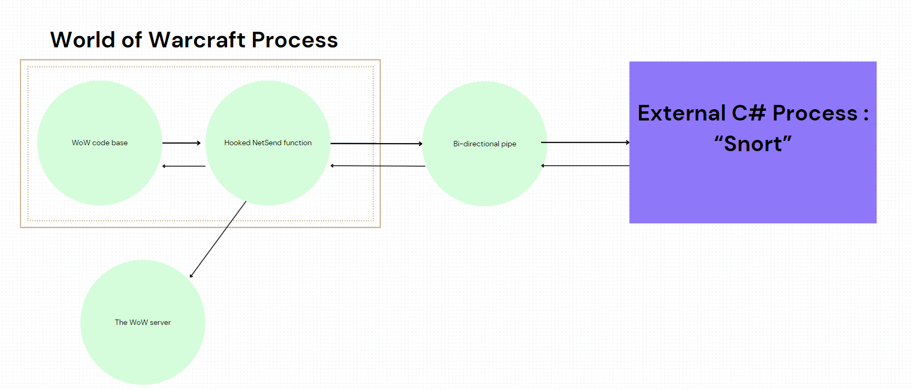

# Hacking World of Warcraft: Part Two - Packet Playtime! 🎉

## 👋 Intro

Welcome back, If you haven’t already checked out Part One of this series, I highly recommend diving into it here: [Part One: Hacking World of Warcraft](https://github.com/MrFade321/Hacking_World_of_Warcraft).

In our last post, I successfully hooked into our `NetSend` function and read out our Opcode `WORD` value. This little victory allowed us to compare the Opcode against the definitions over at Trinity Core. You can check that out [here](https://github.com/TrinityCore/TrinityCore/blob/master/src/server/game/Server/Protocol/Opcodes.h).

Now, In this post, we’re going to start having some serious fun with packets and hopefully build something that makes packet manipulation easy and accessible for everyone!

## 🎯 Goal 

Today, our mission is to create a user-friendly program for editing and managing packets. The idea is to make it so straightforward that anyone can poke around and play with packets!

- Just a reminder: this isn’t a how-to guide for hacking WoW. I won’t be sharing any sensitive code or game-breaking exploits. So, no need to worry about any unintended consequences!

## 📦 Packets 

Alright, we’ve got our hook and `CDataStore` structure set up. Here’s the code we’ll be working with:

```cpp
struct CDataStore
{
    uint64_t* VTable;
    uint8_t* Buffer;
    unsigned int m_base; // 0x10
    int m_alloc;         // 0x14
    unsigned int Length;
    unsigned int m_read; // 0x1C

    CDataStore(unsigned int size)
    {
        VTable = Offset::CDataStore_VTable;
        Buffer = new uint8_t[size];
        m_base = 0;
        m_alloc = 0x100;
        Length = size;
        m_read = 0x10;
    }

    ~CDataStore()
    {
        delete[] Buffer;
        Buffer = nullptr;
    }

    ByteBuffer ToByteBuffer() const {
        ByteBuffer byteBuffer;
        byteBuffer.append(Buffer, Length);
        return byteBuffer;
    }
};
```

Now, we know all the juicy info we need is stored in ByteBuffer, specifically Buffer = new uint8_t[size];.

Our goal is to pass each packet to an external process (in C#) where the user can read, edit, and then send it back to the client. To accomplish this, we’ll be using Pipes. If you’re not familiar with them, check out this handy [guide](https://learn.microsoft.com/en-us/windows/win32/ipc/pipes).

Since all the tasty information about the packet and its contents is stored in the Buffer, all we need to do is send that over the pipe!

## 🎨 Design



Above is a rough flow chart that should hopefully give you a better visual of what is actually happening here. The Wow process is calling our hooked function (NetSend) where our code is placed, our code then writes the passed Bytebuffer onto a pipe that will later be read out from our C# process. The WoW server does of course send packets back down to the client, but that is not within the scope of this project!

```cpp
    DWORD bytesWritten;
    BOOL writeResult = WriteFile(
        hPipe,                      // Pipe handle
        CdataStore->Buffer,       // Message to write
        CdataStore->Length,         // Number of bytes to write
        &bytesWritten,              // Number of bytes written
        NULL                        // Not overlapped
    );


    if (!writeResult) {
        std::cerr << "Error: Failed to write to named pipe. Error code: " << GetLastError() << std::endl;
        MessageBox(0, L"Internal Snort error failed to Write to pipe -> " + GetLastError(), (LPCWSTR)"Y", MB_OK);
        DisconnectNamedPipe(hPipe);
        CloseHandle(hPipe);
        return 1;
    }
```

## 👃 C# process (Snort) !

```C#
                using (MemoryStream memoryStream = new MemoryStream(buffer))
                {
                    // Create a BinaryReader to read from the MemoryStream
                    using (BinaryReader reader = new BinaryReader(memoryStream))
                    {
                        // Read a short value from the buffer
                        memoryStream.Position = 0x10; // Ensure the position is at the start
                        short opcode = reader.ReadInt16();
                        string name = "";

                        if (UseRetailOpcodes)
                        {
                            name = OPcodes.RetailOpcode.GetEnumName<OPcodes.CataOpcode.OpcodeClient>((uint)opcode);
                        }
                        else
                        {
                            name = OPcodes.CataOpcode.GetEnumName<OPcodes.CataOpcode.OpcodeClient>((uint)opcode);
                        }


                        string output = name; //string.Format("Opcode => 0x{0:X4}\n", opcode);
                        output += $" ({opcode.ToString("X4")})";
                        RadListDataItem NewPacket = new RadListDataItem();
                        NewPacket.Tag = PacketCount;
                        NewPacket.Text = output;
                        BlackListed = BlackListOpcodes.Contains(opcode);
                        if (!BlackListed)
                        {
                            Invoke((Action)(() => radListControl1.Items.Add(NewPacket)));
                            CMSG_PACKETs.Add(new CMSG_PACKET(opcode, buffer, bytesRead, name));
                        }


                        if (CatchOpcodes.Contains(opcode))
                        {
                            CurrentPkt = new CMSG_PACKET(opcode, buffer, bytesRead, name, true);
                            PopPacketView();
                            HoldCurrnetPkt = true;
                            while (HoldCurrnetPkt)
                            {
                                Thread.Sleep(100);
                            }
                            buffer = CurrentPkt.Buffer;  // Taking what the user had a chance to change;
                        }

                        if (DropOpcodes.Contains(opcode))
                        {
                            buffer.DefaultIfEmpty();
                            bytesRead = 1;
                        }

                    }
                }


                PipeClient.Write(buffer, 0, bytesRead); /// hopefully this doesnt blow shit up

                if (!BlackListed)
                    PacketCount++;

                Thread.Sleep(10);
            }
```
