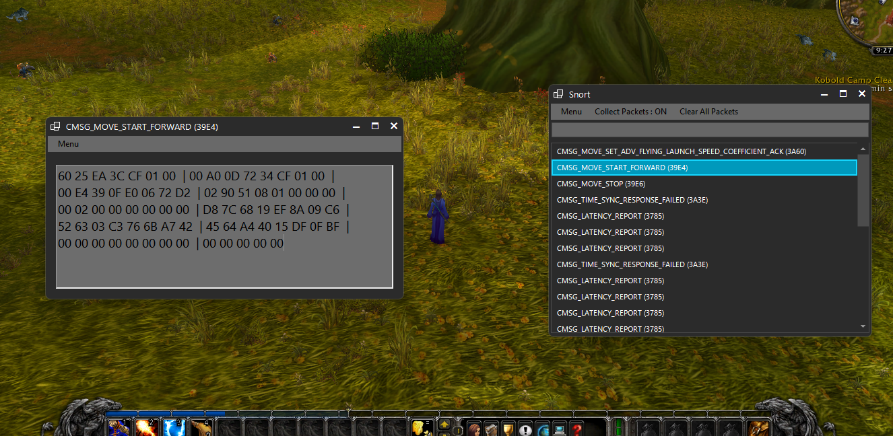
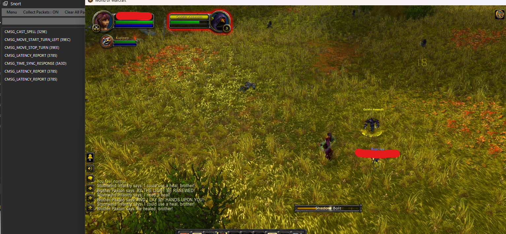

# Hacking World of Warcraft: Part Two - Packet Playtime! 🎉

## 👋 Intro

Welcome back, If you haven’t already checked out Part One of this series, I highly recommend diving into it here: [Part One: Hacking World of Warcraft](https://github.com/MrFade321/Hacking_World_of_Warcraft).

In our last post, I successfully hooked into our `NetSend` function and read out our Opcode `WORD` value. This little victory allowed us to compare the Opcode against the definitions over at Trinity Core. You can check that out [here](https://github.com/TrinityCore/TrinityCore/blob/master/src/server/game/Server/Protocol/Opcodes.h).

Now, In this post, we’re going to start having some serious fun with packets and hopefully build something that makes packet manipulation easy and accessible for everyone!

## 🎯 Goal 

Today, our mission is to create a user-friendly program for editing and managing packets. The idea is to make it so straightforward that anyone can poke around and play with packets!

- Just a reminder: this isn’t a how-to guide for hacking WoW. I won’t be sharing any sensitive code or game-breaking exploits. So, no need to worry about any unintended consequences!

## 📦 Packets 

Alright, we’ve got our hook and `CDataStore` structure set up. Here’s the code we’ll be working with:

```cpp
struct CDataStore
{
    uint64_t* VTable;
    uint8_t* Buffer;
    unsigned int m_base; // 0x10
    int m_alloc;         // 0x14
    unsigned int Length;
    unsigned int m_read; // 0x1C

    CDataStore(unsigned int size)
    {
        VTable = Offset::CDataStore_VTable;
        Buffer = new uint8_t[size];
        m_base = 0;
        m_alloc = 0x100;
        Length = size;
        m_read = 0x10;
    }

    ~CDataStore()
    {
        delete[] Buffer;
        Buffer = nullptr;
    }

    ByteBuffer ToByteBuffer() const {
        ByteBuffer byteBuffer;
        byteBuffer.append(Buffer, Length);
        return byteBuffer;
    }
};
```

Now, we know all the juicy info we need is stored in ByteBuffer, specifically Buffer = new uint8_t[size];.

Our goal is to pass each packet to an external process (in C#) where the user can read, edit, and then send it back to the client. To accomplish this, we’ll be using Pipes. If you’re not familiar with them, check out this handy [guide](https://learn.microsoft.com/en-us/windows/win32/ipc/pipes).

Since all the tasty information about the packet and its contents is stored in the Buffer, all we need to do is send that over the pipe!

## 🎨 Design


Above is a rough flow chart that should hopefully give you a better visual of what is actually happening here. The Wow process is calling our hooked function (NetSend) where our code is placed, our code then writes the passed Bytebuffer onto a pipe that will later be read out from our C# process. The WoW server does of course send packets back down to the client, but that is not within the scope of this project!

```cpp
    DWORD bytesWritten;
    BOOL writeResult = WriteFile(
        hPipe,                      // Pipe handle
        CdataStore->Buffer,       // Message to write
        CdataStore->Length,         // Number of bytes to write
        &bytesWritten,              // Number of bytes written
        NULL                        // Not overlapped
    );


    if (!writeResult) {
        std::cerr << "Error: Failed to write to named pipe. Error code: " << GetLastError() << std::endl;
        MessageBox(0, L"Internal Snort error failed to Write to pipe -> " + GetLastError(), (LPCWSTR)"Y", MB_OK);
        DisconnectNamedPipe(hPipe);
        CloseHandle(hPipe);
        return 1;
    }
```

## 👃 C# process (Snort) !

```C#
        public class CMSG_PACKET
        {
            public CMSG_PACKET(int opcode, byte[] buffer, int size, string name = "", bool livePkt = false)
            {
                Name = name;
                OpCode = opcode;
                Buffer = buffer;
                Size = size;
                LivePkt = livePkt;
            }
            public bool LivePkt = false;
            public string Name = "";
            public int OpCode = 0;
            public byte[] Buffer = new byte[4096];
            public int Size = 0;
        }
```


```C#
                using (MemoryStream memoryStream = new MemoryStream(buffer))
                {
                    using (BinaryReader reader = new BinaryReader(memoryStream))
                    {
                        // Read a short value from the buffer
                        memoryStream.Position = 0x10; // Ensure the position is at the start after the packet header
                        short opcode = reader.ReadInt16();
                        string name = "";

                        if (UseRetailOpcodes)
                        {
                            name = OPcodes.RetailOpcode.GetEnumName<OPcodes.CataOpcode.OpcodeClient>((uint)opcode);
                        }
                        else
                        {
                            name = OPcodes.CataOpcode.GetEnumName<OPcodes.CataOpcode.OpcodeClient>((uint)opcode);
                        }

                        string output = name; //string.Format("Opcode => 0x{0:X4}\n", opcode);
                        output += $" ({opcode.ToString("X4")})";
                        RadListDataItem NewPacket = new RadListDataItem();
                        NewPacket.Tag = PacketCount;
                        NewPacket.Text = output;
                        BlackListed = BlackListOpcodes.Contains(opcode);
                        if (!BlackListed)
                        {
                            Invoke((Action)(() => radListControl1.Items.Add(NewPacket)));
                            CMSG_PACKETs.Add(new CMSG_PACKET(opcode, buffer, bytesRead, name));
                        }

                        if (CatchOpcodes.Contains(opcode))
                        {
                            CurrentPkt = new CMSG_PACKET(opcode, buffer, bytesRead, name, true);
                            PopPacketView();
                            HoldCurrnetPkt = true;
                            while (HoldCurrnetPkt)
                            {
                                Thread.Sleep(100);
                            }
                            buffer = CurrentPkt.Buffer;  // Taking what the user had a chance to change;
                        }

                        if (DropOpcodes.Contains(opcode))
                        {
                            buffer.DefaultIfEmpty();
                            bytesRead = 1;
                        }
                    }
                }

                PipeClient.Write(buffer, 0, bytesRead); // Write our "New" buffer back to the pipe

                if (!BlackListed)
                    PacketCount++;
                Thread.Sleep(10);
            }
```

The above code should give you a rough idea on how I am handling the information in the C# process. Note that the C# process is also writing a buffer back to the pipe. That buffer is then read off the pipe once again from our C++ DLL (within the WoW process) and the result is what is actually sent through the NetSend function and ultimately to the WoW server.

## 🧙‍♂️ The Magic of time travel!

In an effort to finish this series this year I am going to skip over a lot of minor details to get to the juicy stuff, just know that the core principle has not changed. I am simply hooking and piping data between the two processes. I have just added a lot of polish and QoL things along the way.

## 👃 Snort!



In the snort process you will see a list of packets that has been captured from the WoW process double clicking on any of them will open a new Packet viewer window where the byte buffer[] will simply be displayed. From there the user can edit and resend the packet !

## 🕵️‍♂️ Lets make an AimBot for Wow!

Now that we have full access to all of the packets the client sends to the game server lets try poke fun at the movement logic. If you have ever played WoW before, you know that in order to cast a spell we need to be facing the target. 
Lets see if we can do anything "assit" in that.

First off we need the actual rotation angel that player should be at in order to actually be "facing" our target we can do that with some basic trig :

```cpp
		// Compute the direction vector from the player to the target
		float dirX = *TargetX - PlayerX;
		float dirY = *TargetY - PlayerY;
		float dirZ = *TargetZ - PlayerZ;

		// Compute the angle to face the target
		// Assuming the facing direction is in the XY plane
		// and is given by the angle from the X-axis to the direction vector
		float angle = std::atan2(dirY, dirX); // Angle in radians

		// Normalize the angle to the range [0, 2pi]
		if (angle < 0) {
			angle += 2 * M_PI;
		}
```

I wont go into detail on how I am reading the position data of the player and the target. There are loads of posts about reading WoWs memory out there, if that is something you're interested in. Google it!

Once we have the correct facing angel, we can craft our own :
```
CMSG_MOVE_START_TURN_LEFT                         = 0x39EC
```

Followed by :

```
CMSG_MOVE_STOP_TURN                               = 0x39EE
```

Of course in the actual packet data we are placing our "correct" facing angel to the target we are attempting to cast on. 



And just like that we can now cast on mobs without correctly facing them ! Although, Serverside (and for anyone else watching our player). We are basically snapping our player rotation to face our target. No doubt this will look strange for anyone watching us, as our character 180s for time we cast!


# 📚 Conclusion of Part 2

I feel that this is a decent place to stop Part 2, I have sucessfully built out a tool that allow us to test WoW server side anti-cheat logic. There is obviously at more that can be done with such a tool but in hope of not getting in trouble, I don't know how much more I will share ! 

Thank you all for reading if you have any questions you are more than welcome to reach me on discord :

_mrfade_
